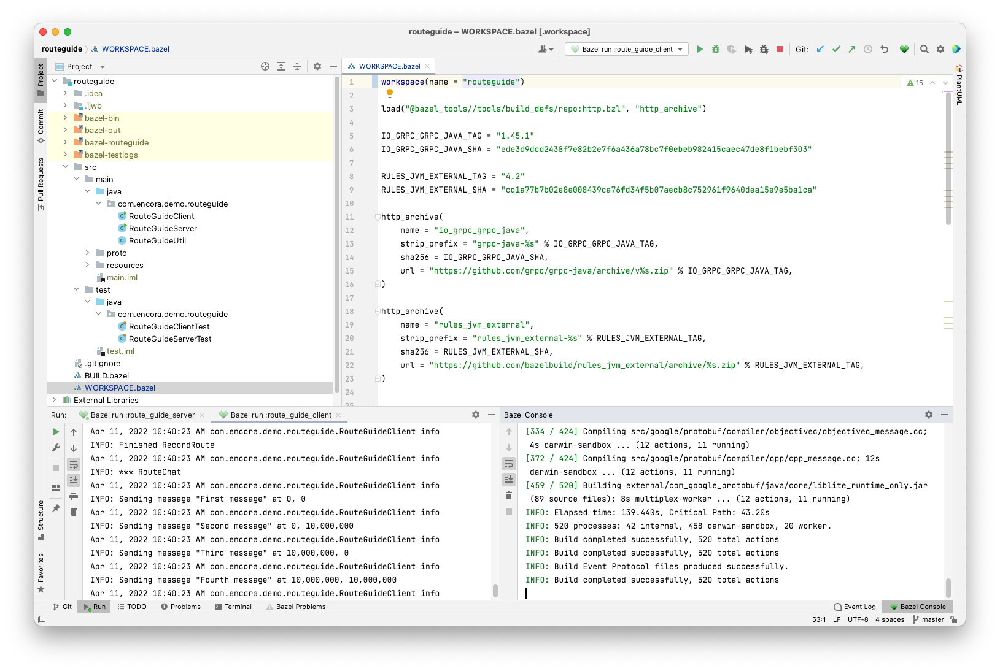
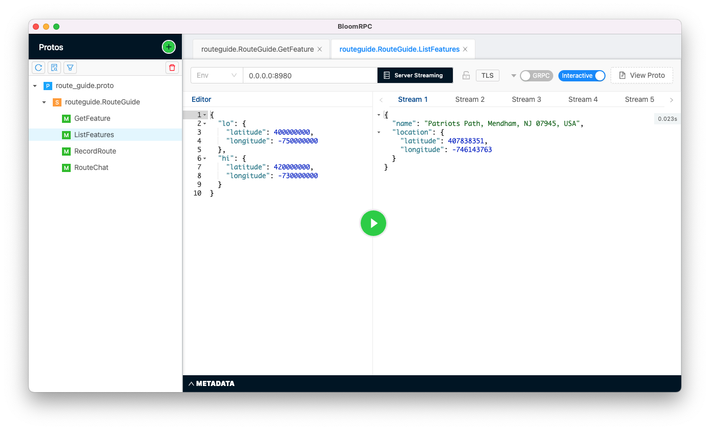

gRPC-Java, Bazel, Guice Example
=======================

This is a basic example to handle a [gRPC-Java](https://grpc.io/docs/languages/java/) project using [Bazel](https://bazel.build/) for building and [Guice](https://github.com/google/guice) for dependency injection.  
It is based on the [gRPC-Java Basic Tutorial](https://grpc.io/docs/languages/java/basics/).

## Prerequisites

 1. Install Java JDK 11 at least.
 2. Install Bazel locally [https://bazel.build/install](https://bazel.build/install)
 3. Install IntelliJ Bazel Plugin [https://ij.bazel.build/docs/bazel-plugin.html](https://ij.bazel.build/docs/bazel-plugin.html)

## Build, Run and Test

 - Clone the project locally and open the project [routeguide](https://github.com/sashirestela/grpc-java-bazel-example/tree/master/routeguide) in IntelliJ.
   
 - Follow the instructions from the Bazel Plugin to [import the project](https://ij.bazel.build/docs/import-project.html) as a Bazel project.
    
 - Build the project with the option: Bazel > Build > Compile Project.
    
 - Run and Test the project with [these steps](https://ij.bazel.build/docs/run-configurations.html).

## Support for Bazel in IntelliJ

IntelliJ provide a basic support to build/test/run Bazel projects.

## Test gRPC with BloomRPC

[BloomRPC](https://github.com/bloomrpc/bloomrpc) is a GUI client for texting gRPC services.

